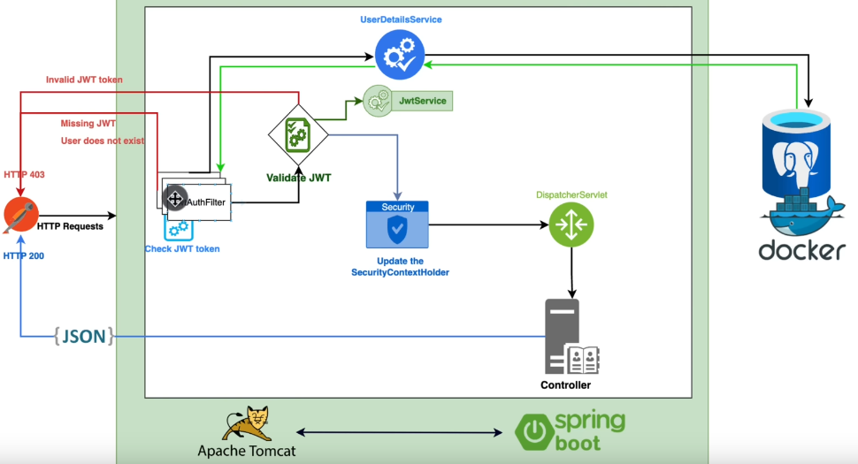

## A arquitetura usada no projeto para authenticação.



### Docker compose

#### Vamos adicionar o docker-compose para usar o postgresql

```docker
version: '3.1'

services:
  db:
    image: postgres:14.3
    restart: always
    environment:
      POSTGRES_PASSWORD: postgres123
    ports:
      - "5435:5432"
```

### Role

#### Usado para especificar qual tipo de User é.

```java
package com.navas.security.user;

public enum Role {
    USER,
    ADMIN
}
```

### User Model

#### A classe User está o mais simples possível, ela implementa o UserDetails que é o User do SpringBoot.

```java
package com.navas.security.user;

import jakarta.persistence.*;
import lombok.AllArgsConstructor;
import lombok.Builder;
import lombok.Data;
import lombok.NoArgsConstructor;
import org.springframework.security.core.GrantedAuthority;
import org.springframework.security.core.authority.SimpleGrantedAuthority;
import org.springframework.security.core.userdetails.UserDetails;

import java.util.Collection;
import java.util.List;

@Data
@AllArgsConstructor
@NoArgsConstructor
@Builder
@Entity
@Table(name = "users")
public class User implements UserDetails {

    @Id
    @GeneratedValue(strategy = GenerationType.SEQUENCE)
    private Integer id;
    private String firstname;
    private String lastname;

    @Column(unique = true, nullable = false)
    private String email;

    @Column(nullable = false)
    private String password;

    @Column(nullable = false)
    @Enumerated(EnumType.STRING)
    private Role role;

    @Override
    public Collection<? extends GrantedAuthority> getAuthorities() {
        return List.of(new SimpleGrantedAuthority(role.name()));
    }

    @Override
    public String getUsername() {
        return getEmail();
    }

    @Override
    public boolean isAccountNonExpired() {
        return true;
    }

    @Override
    public boolean isAccountNonLocked() {
        return true;
    }

    @Override
    public boolean isCredentialsNonExpired() {
        return true;
    }

    @Override
    public boolean isEnabled() {
        return true;
    }
}
```

### UserRepository

#### Para buscar os dados do User usaremos a interface UserRepository

```java
package com.navas.security.user;

import org.springframework.data.jpa.repository.JpaRepository;

import java.util.Optional;

public interface UserRepository extends JpaRepository<User, Integer> {
    Optional<User> findUserByUsername(String username);
}
```

### JwtAuthenticationFilter

#### Toda vez que a API receber uma requisição, será chamado esse JwtAuthenticationFilter, podendo adicionar e remover Headeres por exemplo

```java
package com.navas.security.config;

import jakarta.servlet.FilterChain;
import jakarta.servlet.ServletException;
import jakarta.servlet.http.HttpServletRequest;
import jakarta.servlet.http.HttpServletResponse;
import lombok.RequiredArgsConstructor;
import org.springframework.lang.NonNull;
import org.springframework.stereotype.Component;
import org.springframework.web.filter.OncePerRequestFilter;

import java.io.IOException;

@Component
@RequiredArgsConstructor
public class JwtAuthenticationFilter extends OncePerRequestFilter {
    @Override
    protected void doFilterInternal(
            @NonNull HttpServletRequest request,
            @NonNull HttpServletResponse response,
            @NonNull FilterChain filterChain) throws ServletException, IOException {

    }
}
```

- Para obter o username do token JWT do header, temos que implementar essa parte do código, no método doFilterInternal,
  da classe
  JWTAuthenticationFilter

```java
package com.navas.security.config;

import jakarta.servlet.FilterChain;
import jakarta.servlet.ServletException;
import jakarta.servlet.http.HttpServletRequest;
import jakarta.servlet.http.HttpServletResponse;
import lombok.RequiredArgsConstructor;
import org.springframework.lang.NonNull;
import org.springframework.stereotype.Component;
import org.springframework.web.filter.OncePerRequestFilter;

import java.io.IOException;

@Component
@RequiredArgsConstructor
public class JwtAuthenticationFilter extends OncePerRequestFilter {

    private final JwtService jwtService;

    @Override
    protected void doFilterInternal(
            @NonNull HttpServletRequest request,
            @NonNull HttpServletResponse response,
            @NonNull FilterChain filterChain) throws ServletException, IOException {
        final String authHeader = request.getHeader("Authorization");
        final String jwt;
        final String bearerName = "Bearer ";
        final String username;
        if (authHeader == null || !authHeader.startsWith(bearerName)) {
            filterChain.doFilter(request, response);
        }
        jwt = authHeader.substring(bearerName.length());
        username = jwtService.extractUsername(jwt); // TODO: extract the email from JWT token;
    }
}
```

### JwtService

#### Usado para obter extrair o username do JWT token, e qualquer outro tipo de dado do Claim

```java
package com.navas.security.config;

import io.jsonwebtoken.Claims;
import io.jsonwebtoken.Jwts;
import io.jsonwebtoken.io.Decoders;
import io.jsonwebtoken.security.Keys;
import org.springframework.stereotype.Service;

import java.security.Key;
import java.util.function.Function;

@Service
public class JwtService {

    // TODO: use the @Value(value = "${jwt.secret-key}") to remove this hardcode
    private static final String SECRET_KEY_HEX = "038bc9ba07236454625a53500231616945554efdcf05ea72a0cb8a7be1a5c7e3";

    public String extractUsername(String token) {
        return extractClaim(token, Claims::getSubject);
    }

    private <T> T extractClaim(String token, Function<Claims, T> claimsResolver) {
        final Claims claims = extractAllClaims(token);
        return claimsResolver.apply(claims);
    }

    private Claims extractAllClaims(String token) {
        return Jwts
                .parserBuilder()
                .setSigningKey(getSignInKey())
                .build()
                .parseClaimsJws(token)
                .getBody();
    }

    private Key getSignInKey() {
        byte[] keyBytes = Decoders.BASE64.decode(SECRET_KEY_HEX);
        return Keys.hmacShaKeyFor(keyBytes);
    }
}
```

- Implementado a geração de JWT token com e sem claims extra dentro da classe JwtService

```java
package com.navas.security.config;

import io.jsonwebtoken.Claims;
import io.jsonwebtoken.Jwts;
import io.jsonwebtoken.SignatureAlgorithm;
import io.jsonwebtoken.io.Decoders;
import io.jsonwebtoken.security.Keys;
import org.springframework.security.core.userdetails.UserDetails;
import org.springframework.stereotype.Service;

import java.security.Key;
import java.util.Date;
import java.util.HashMap;
import java.util.Map;
import java.util.function.Function;

@Service
public class JwtService {

    // TODO: use the @Value(value = "${jwt.secret-key}") to remove this hardcode
    private static final String SECRET_KEY_HEX = "038bc9ba07236454625a53500231616945554efdcf05ea72a0cb8a7be1a5c7e3";

    public String extractUsername(String token) {
        return extractClaim(token, Claims::getSubject);
    }

    private <T> T extractClaim(String token, Function<Claims, T> claimsResolver) {
        final Claims claims = extractAllClaims(token);
        return claimsResolver.apply(claims);
    }

    public String generateToken(
            Map<String, Object> extraClaims,
            UserDetails userDetails
    ) {
        long ONE_DAY = 1000 * 60 * 60 * 24;
        return Jwts
                .builder()
                .setClaims(extraClaims)
                .setSubject(userDetails.getUsername())
                .setIssuedAt(new Date(System.currentTimeMillis()))
                .setExpiration(new Date(System.currentTimeMillis() + ONE_DAY))
                .signWith(getSignInKey(), SignatureAlgorithm.ES256)
                .compact();
    }

    public String generateToken(UserDetails userDetails) {
        return generateToken(new HashMap<>(), userDetails);
    }

    private Claims extractAllClaims(String token) {
        return Jwts
                .parserBuilder()
                .setSigningKey(getSignInKey())
                .build()
                .parseClaimsJws(token)
                .getBody();
    }

    private Key getSignInKey() {
        byte[] keyBytes = Decoders.BASE64.decode(SECRET_KEY_HEX);
        return Keys.hmacShaKeyFor(keyBytes);
    }
}
```

- Implementado se o JWT token é válido

```java
package com.navas.security.config;

import io.jsonwebtoken.Claims;
import io.jsonwebtoken.Jwts;
import io.jsonwebtoken.SignatureAlgorithm;
import io.jsonwebtoken.io.Decoders;
import io.jsonwebtoken.security.Keys;
import org.springframework.security.core.userdetails.UserDetails;
import org.springframework.stereotype.Service;

import java.security.Key;
import java.util.Date;
import java.util.HashMap;
import java.util.Map;
import java.util.function.Function;

@Service
public class JwtService {

    // TODO: use the @Value(value = "${jwt.secret-key}") to remove this hardcode
    private static final String SECRET_KEY_HEX = "038bc9ba07236454625a53500231616945554efdcf05ea72a0cb8a7be1a5c7e3";

    public String extractUsername(String token) {
        return extractClaim(token, Claims::getSubject);
    }

    private Date extractExpiration(String token) {
        return extractClaim(token, Claims::getExpiration);
    }

    private <T> T extractClaim(String token, Function<Claims, T> claimsResolver) {
        final Claims claims = extractAllClaims(token);
        return claimsResolver.apply(claims);
    }

    public String generateToken(
            Map<String, Object> extraClaims,
            UserDetails userDetails
    ) {
        long ONE_DAY = 1000 * 60 * 60 * 24;
        return Jwts
                .builder()
                .setClaims(extraClaims)
                .setSubject(userDetails.getUsername())
                .setIssuedAt(new Date(System.currentTimeMillis()))
                .setExpiration(new Date(System.currentTimeMillis() + ONE_DAY))
                .signWith(getSignInKey(), SignatureAlgorithm.ES256)
                .compact();
    }

    public boolean isTokenValid(String token, UserDetails userDetails) {
        final String username = extractUsername(token);
        final boolean usernameEquals = username.equals(userDetails.getUsername());
        return usernameEquals && !isTokenExpired(token);
    }

    private boolean isTokenExpired(String token) {
        final Date now = new Date();
        return extractExpiration(token).before(now);
    }

    public String generateToken(UserDetails userDetails) {
        return generateToken(new HashMap<>(), userDetails);
    }

    private Claims extractAllClaims(String token) {
        return Jwts
                .parserBuilder()
                .setSigningKey(getSignInKey())
                .build()
                .parseClaimsJws(token)
                .getBody();
    }

    private Key getSignInKey() {
        byte[] keyBytes = Decoders.BASE64.decode(SECRET_KEY_HEX);
        return Keys.hmacShaKeyFor(keyBytes);
    }
}
```

### JwtAuthenticationFilter

### Refatoração no método doFilterInternal, separando a lógica de extrair o JWT token do header.

```java
package com.navas.security.config;

import jakarta.servlet.FilterChain;
import jakarta.servlet.ServletException;
import jakarta.servlet.http.HttpServletRequest;
import jakarta.servlet.http.HttpServletResponse;
import lombok.RequiredArgsConstructor;
import org.springframework.lang.NonNull;
import org.springframework.stereotype.Component;
import org.springframework.web.filter.OncePerRequestFilter;

import java.io.IOException;

@Component
@RequiredArgsConstructor
public class JwtAuthenticationFilter extends OncePerRequestFilter {

    private final JwtService jwtService;

    @Override
    protected void doFilterInternal(
            @NonNull HttpServletRequest request,
            @NonNull HttpServletResponse response,
            @NonNull FilterChain filterChain) throws ServletException, IOException {
        final String jwt = extractTokenFromHeader(request, response, filterChain);
        final String username = jwtService.extractUsername(jwt);
    }

    private static String extractTokenFromHeader(HttpServletRequest request, HttpServletResponse response,
                                                 FilterChain filterChain) throws IOException, ServletException {
        final String authHeader = request.getHeader("Authorization");
        final String jwt;
        final String bearerName = "Bearer ";
        final String username;
        if (authHeader == null || !authHeader.startsWith(bearerName)) {
            filterChain.doFilter(request, response);
        }
        jwt = authHeader.substring(bearerName.length());
        return jwt;
    }
}
```

- Verificar se o user detail existe e se ele não está logado

```java
package com.navas.security.config;

import jakarta.servlet.FilterChain;
import jakarta.servlet.ServletException;
import jakarta.servlet.http.HttpServletRequest;
import jakarta.servlet.http.HttpServletResponse;
import lombok.RequiredArgsConstructor;
import org.springframework.lang.NonNull;
import org.springframework.security.core.context.SecurityContextHolder;
import org.springframework.security.core.userdetails.UserDetails;
import org.springframework.security.core.userdetails.UserDetailsService;
import org.springframework.stereotype.Component;
import org.springframework.web.filter.OncePerRequestFilter;

import java.io.IOException;

@Component
@RequiredArgsConstructor
public class JwtAuthenticationFilter extends OncePerRequestFilter {

    private final JwtService jwtService;
    private UserDetailsService userDetailsService;

    @Override
    protected void doFilterInternal(
            @NonNull HttpServletRequest request,
            @NonNull HttpServletResponse response,
            @NonNull FilterChain filterChain) throws ServletException, IOException {
        final String jwt = extractTokenFromHeader(request, response, filterChain);

        final String userEmail = jwtService.extractUsername(jwt);
        boolean userNotConnected = SecurityContextHolder.getContext().getAuthentication() == null;
        if (userEmail != null && userNotConnected) {
            UserDetails userDetails = userDetailsService.loadUserByUsername(userEmail);
        }
    }

    private static String extractTokenFromHeader(HttpServletRequest request, HttpServletResponse response,
                                                 FilterChain filterChain) throws IOException, ServletException {
        final String authHeader = request.getHeader("Authorization");
        final String jwt;
        final String bearerName = "Bearer ";
        final String username;
        if (authHeader == null || !authHeader.startsWith(bearerName)) {
            filterChain.doFilter(request, response);
        }
        jwt = authHeader.substring(bearerName.length());
        return jwt;
    }
}
```

- Configurar o Bean do UserDetailService para usar no projeto, criado na classe ApplicationConfig

```java
package com.navas.security.config;

import com.navas.security.user.UserRepository;
import lombok.RequiredArgsConstructor;
import org.springframework.context.annotation.Bean;
import org.springframework.context.annotation.Configuration;
import org.springframework.security.core.userdetails.UserDetailsService;
import org.springframework.security.core.userdetails.UsernameNotFoundException;

@Configuration
@RequiredArgsConstructor
public class ApplicationConfig {

    private final UserRepository userRepository;

    @Bean
    public UserDetailsService userDetailsService() {
        return username -> userRepository
                .findUserByUsername(username)
                .orElseThrow(() -> new UsernameNotFoundException("user not found"));
    }
}
```

- Refatorar a verificação do JWT token

```java
package com.navas.security.config;

import jakarta.servlet.FilterChain;
import jakarta.servlet.ServletException;
import jakarta.servlet.http.HttpServletRequest;
import jakarta.servlet.http.HttpServletResponse;
import lombok.RequiredArgsConstructor;
import org.springframework.lang.NonNull;
import org.springframework.security.authentication.UsernamePasswordAuthenticationToken;
import org.springframework.security.core.context.SecurityContextHolder;
import org.springframework.security.core.userdetails.UserDetails;
import org.springframework.security.core.userdetails.UserDetailsService;
import org.springframework.security.web.authentication.WebAuthenticationDetailsSource;
import org.springframework.stereotype.Component;
import org.springframework.web.filter.OncePerRequestFilter;

import java.io.IOException;

@Component
@RequiredArgsConstructor
public class JwtAuthenticationFilter extends OncePerRequestFilter {

    private final JwtService jwtService;
    private UserDetailsService userDetailsService;

    @Override
    protected void doFilterInternal(
            @NonNull HttpServletRequest request,
            @NonNull HttpServletResponse response,
            @NonNull FilterChain filterChain) throws ServletException, IOException {
        final String jwt = extractTokenFromHeader(request, response, filterChain);

        final String userEmail = jwtService.extractUsername(jwt);
        boolean userNotConnected = SecurityContextHolder.getContext().getAuthentication() == null;
        if (userEmail != null && userNotConnected) {
            UsernamePasswordAuthenticationToken authToken = validateJwt(request, jwt, userEmail);
        }
    }

    private UsernamePasswordAuthenticationToken validateJwt(HttpServletRequest request, String jwt, String userEmail) {
        UserDetails userDetails = userDetailsService.loadUserByUsername(userEmail);
        if (jwtService.isTokenValid(jwt, userDetails)) {
            UsernamePasswordAuthenticationToken authToken = new UsernamePasswordAuthenticationToken(
                    userDetails,
                    null,
                    userDetails.getAuthorities()
            );
            authToken.setDetails(
                    new WebAuthenticationDetailsSource().buildDetails(request)
            );
            return authToken;
        }
        return null;
    }

    private static String extractTokenFromHeader(HttpServletRequest request, HttpServletResponse response,
                                                 FilterChain filterChain) throws IOException, ServletException {
        final String authHeader = request.getHeader("Authorization");
        final String jwt;
        final String bearerName = "Bearer ";
        final String username;
        if (authHeader == null || !authHeader.startsWith(bearerName)) {
            filterChain.doFilter(request, response);
        }
        jwt = authHeader.substring(bearerName.length());
        return jwt;
    }
}
```

- Atualizar o SecurityContextHolder com o UsernamePasswordAuthenticationToken

```java
package com.navas.security.config;

import jakarta.servlet.FilterChain;
import jakarta.servlet.ServletException;
import jakarta.servlet.http.HttpServletRequest;
import jakarta.servlet.http.HttpServletResponse;
import lombok.RequiredArgsConstructor;
import org.springframework.lang.NonNull;
import org.springframework.security.authentication.UsernamePasswordAuthenticationToken;
import org.springframework.security.core.context.SecurityContextHolder;
import org.springframework.security.core.userdetails.UserDetails;
import org.springframework.security.core.userdetails.UserDetailsService;
import org.springframework.security.web.authentication.WebAuthenticationDetailsSource;
import org.springframework.stereotype.Component;
import org.springframework.web.filter.OncePerRequestFilter;

import java.io.IOException;

@Component
@RequiredArgsConstructor
public class JwtAuthenticationFilter extends OncePerRequestFilter {

    private final JwtService jwtService;
    private final UserDetailsService userDetailsService;

    @Override
    protected void doFilterInternal(
            @NonNull HttpServletRequest request,
            @NonNull HttpServletResponse response,
            @NonNull FilterChain filterChain) throws ServletException, IOException {
        final String jwt = extractTokenFromHeader(request, response, filterChain);

        final String userEmail = jwtService.extractUsername(jwt);
        boolean userNotConnected = SecurityContextHolder.getContext().getAuthentication() == null;
        if (userEmail != null && userNotConnected) {
            UsernamePasswordAuthenticationToken authToken = validateJwt(request, jwt, userEmail);
            updateSecurityContextHolder(authToken);
        }
        filterChain.doFilter(request, response);
    }

    private static void updateSecurityContextHolder(UsernamePasswordAuthenticationToken authToken) {
        if (authToken != null) {
            SecurityContextHolder.getContext().setAuthentication(authToken);
        }
    }

    private UsernamePasswordAuthenticationToken validateJwt(HttpServletRequest request, String jwt, String userEmail) {
        UserDetails userDetails = userDetailsService.loadUserByUsername(userEmail);
        if (jwtService.isTokenValid(jwt, userDetails)) {
            UsernamePasswordAuthenticationToken authToken = new UsernamePasswordAuthenticationToken(
                    userDetails,
                    null,
                    userDetails.getAuthorities()
            );
            authToken.setDetails(
                    new WebAuthenticationDetailsSource().buildDetails(request)
            );
            return authToken;
        }
        return null;
    }

    private static String extractTokenFromHeader(HttpServletRequest request, HttpServletResponse response,
                                                 FilterChain filterChain) throws IOException, ServletException {
        final String authHeader = request.getHeader("Authorization");
        final String jwt;
        final String bearerName = "Bearer ";
        final String username;
        if (authHeader == null || !authHeader.startsWith(bearerName)) {
            filterChain.doFilter(request, response);
        }
        jwt = authHeader.substring(bearerName.length());
        return jwt;
    }
}
```